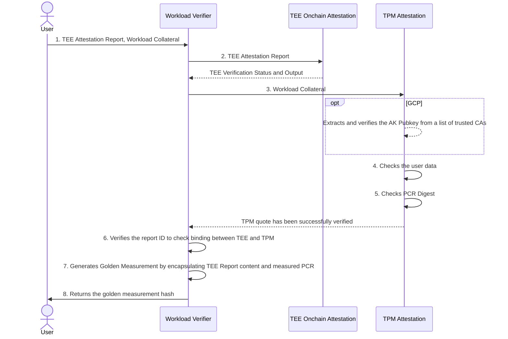

# Automata TEE Workload Measurement

This repo contains the onchain program (smart contracts) for verifying the integrity and measurement of a Confidential VM (CVM) workload hosted on cloud service providers.

Code and data in CVMs are protected from tampering by the host OS (and other CVMs) with TEE hardware, such as Intel TDX and AMD SEV-SNP. Cloud service providers generally also equip CVMs with virtual TPM, to cryptographically store measurements of the boot process, ensuring integrity of the CVM image.

Currently, the Workload verifier contract supports users who provisioned their CVMs equiped with Intel TDX or AMD-SEV-SNP, running on either Azure or Google Cloud Platform (GCP). The full workflow has been implemented in Solidity for EVM network. Click [here](./contracts/README.md) to learn more.

Ideally, the goal of this project is to be platform agnostic, covering as wide range of users as possible. We strive to continue to work diligently to support more TEEs, cloud providers and Web3 ecosystems.

## Overview

1. The user submits data hash, TEE Attestation Report, and the workload collateral to the `WorkloadVerifier.sol` contract. Workload collateral is a collection of data, consisting the TPM quote, TPM Signature, TPM Attestation Key (or AK certificate chain) and an array of PCR measurement.

2. TEE Attestation Report verification shows that the CVM is running in a TEE provided by genuine hardware.
    
    > a. If the CVM were hosted on Azure, this step also ensures that the report data must contain the hash of the TPM Attestation Key.

3. The TPM quote and signature are verified against the provided TPM Attestation Key.
    
    > a. If TPM Attestation Key were not checked in *step 2(a)*, the key is extracted from the leaf of the AK Certificate Chain, which must be checked for valid root of trust.

4. The `extraData` value in the TPM quote is extracted, which must equal the hash of the user's expected data (`userDataHash`).

5. The list of PCR indices provided in the collateral must match with the PCR selection bitmap in the TPM quote; the hash chain of PCR measurement values yields a value that must match the PCR digest value in the TPM quote.

6. The provided Report ID must be found in both TEE Attestation Report and PCR 16 of the TPM. This step indicates the binding between TEE and TPM.
    
    > a. The only exception to this rule applies to Azure TDX CVM. As stated in *2(a)*, the report data provides us with information about the AK that signs the TPM quote, which is already verified in *step 3*.

7. Generates the [Golden Measurement](https://github.com/automata-network/tee-workload-measurement/blob/e1594891136ba0f33e091cd543fdddb822ffa3d5/contracts/src/lib/LibTEE.sol#L41-L45) object. A data structure containing the content of the TEE Report and an array of measured PCRs. Each PCR may contain a deterministic PCR value and/or a list of event logs that the workload produces.

    > a. External contracts may retrieve the Golden Measurement instead of the hash, if developers intend to perform additional checks on the measurement values.

8. Computes the Golden Measurement Hash. Developers can provide their own golden measurement hash for their applications, which can be referenced against the returned hash to check the integrity of the CVM.

## Deployment Info

TBD

## Licensing

This project is currently licensed under [Apache](./LICENSE).

## Contributing

Contributions are welcome! Please ensure all tests pass and follow the existing code style.

## Support

For questions and support, please open an issue.