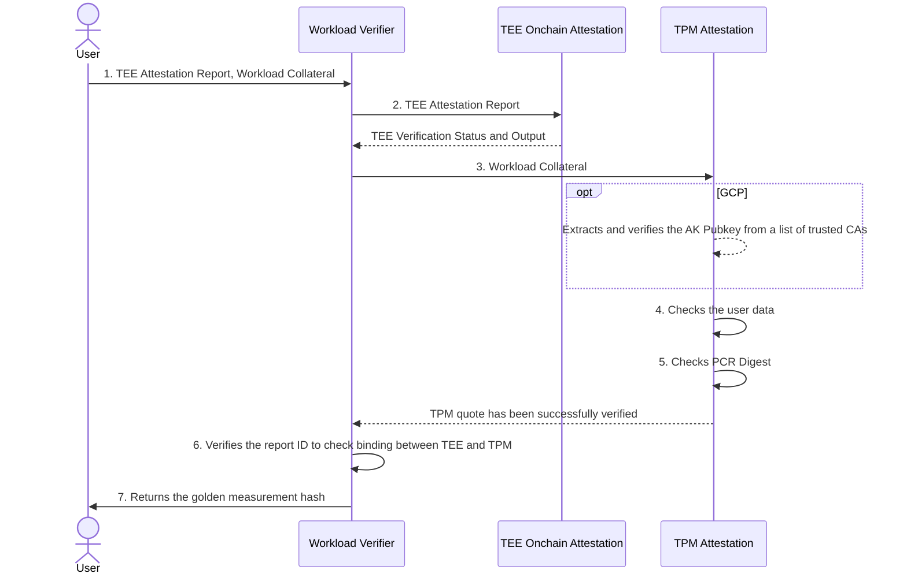

# Automata TEE Workload Measurement (EVM Smart Contract)

This document describes the onchain verification and measurement of the workload of a Confidential VM (CVM) instance hosted on cloud service providers, e.g. Azure and Google Cloud Platform (GCP).

Code and data in CVMs are protected from tampering by the host OS (and other CVMs) with TEE hardware, such as Intel TDX and AMD SEV-SNP. Cloud service providers generally also equip CVMs with virtual TPM, to cryptographically store measurements of the boot process, ensuring integrity of the CVM image.

<!-- TODO: Provide more description on what the users can do with the TEE Workload Measurement contracts -->

TEE Onchain Workload Measurement currently consists of the following smart contracts:

- [`WorkloadVerifier.sol`](./src/WorkloadVerifier.sol): 
    - Depends on (1) [Automata DCAP Attestation](https://github.com/automata-network/automata-dcap-attestation/tree/main/evm) to verify Intel TDX quotes, and (2) [Automata SEV-SNP Attestation](https://github.com/automata-network/amd-sev-snp-attestation-sdk/tree/main/zk/contracts) to verify AMD SEV SNP attestation reports.
    - Verifies the associated TPM quote via the TPM Attestation contract.
    - Computes the **Golden Measurement Hash**.
- [`TpmAttestation.sol`](./src/TpmAttestation.sol): 
    - Independent contract that verifies the signature of a TPM quote, and checks the PCR measurement against the PCR digest value stated in the quote.
    - An admin must configure a whitelist of reputable TPM AK Certificate Authorities.

## Overview



1. The user submits data hash, TEE Attestation Report, and the workload collateral to the `WorkloadVerifier.sol` contract. Workload collateral is a collection of data, consisting the TPM quote, TPM Signature, TPM Attestation Key (or AK certificate chain) and an array of PCR measurement.

2. TEE Attestation Report verification shows that the CVM is running in a TEE provided by genuine hardware.
    
    > a. If the CVM were hosted on Azure, this step also ensures that the report data must contain the hash of the TPM Attestation Key.

3. The TPM quote and signature are verified against the provided TPM Attestation Key.
    
    > a. If TPM Attestation Key were not checked in *step 2(a)*, the key is extracted from the leaf of the AK Certificate Chain, which must be checked for valid root of trust.

4. The `extraData` value in the TPM quote is extracted, which must equal the hash of the user's expected data (`userDataHash`).

5. The list of PCR indices provided in the collateral must match with the PCR selection bitmap in the TPM quote; the hash chain of PCR measurement values yields a value that must match the PCR digest value in the TPM quote.

6. The provided Report ID must be found in both TEE Attestation Report and PCR 16 of the TPM. This step indicates the binding between TEE and TPM.
    
    > a. The only exception to this rule applies to Azure TDX CVM. As stated in *2(a)*, the report data provides us with information about the AK that signs the TPM quote, which is already verified in *step 3*.

7. Computes the Golden Measurement Hash. Developers can provide their own golden measurement hash for their applications, which can be referenced against the returned hash to check the integrity of the CVM.

## #BUIDL 🛠️

1. Install [`Foundry`]().

2. Make sure you are on the `/contracts` directory, then install the dependencies.

```shell
forge install
```

3. Compile the contracts.

```shell
forge build --sizes
```

4. Run the tests.

```shell
forge test
```

## Gas Benchmark

The table below shows our initial finding on gas costs to measure CVMs with various TEEs hosted on Azure and GCP.

|  | TEE Report Verification Gas Cost | AK Pubkey Verification Gas Cost | TPM Signature Verification Gas Cost | PCRs and User Data Matching Gas Cost | Report ID Binding Check Gas Cost | Golden Measurement Hashing Gas Cost |
| --- | --- | --- | --- | --- | --- | --- |
| Azure TDX | ~5M[^1] gas (Onchain DCAP) | 49k[^2] gas | 37k gas (RSA) | 10k gas | 3k gas | 13k gas |
| Azure AMD-SEV-SNP | 240k[^3] gas (RiscZero Groth16) | 49k[^2] gas | 37k gas (RSA) | 10k gas | 3k gas | 13k gas |
| GCP TDX | ~5M[^1] gas (Onchain DCAP) | 384k[^4] gas | 335k[^1] gas (secp256r1) | 10k gas | 482k[^5] gas | 26k gas |
| GCP AMD-SEV-SNP | 240k[^3] gas (RiscZero Groth16) | 384k[^4] gas | 335k[^1] gas (secp256r1) | 19k gas | 5k gas | 25k gas |

### Remark:

[^1]: secp256r1 ECDSA is executed with the [daimo-p256](https://github.com/daimo-eth/p256-verifier) contract. The gas cost is about 330k per signature. EVM Chains that implement [RIP 7212](https://github.com/ethereum/RIPs/blob/master/RIPS/rip-7212.md) can significantly reduce cost to only 3450 gas per signature.

[^2]: TEE Attestation Report generated by CVMs on Azure already contains the hash of the TPM Attestation Key, hence confirming its association with the TPM quote. This step merely parses `azure_var.json` to extract the TPM Attestation public key. This step will fail if the users did not provide `azure_var.json` as part of the workload collateral.

[^3]: AMD-SEV-SNP attestation report currently can only be verified onchain using SNARK proofs. The proof provided in our test is generated by a [RiscZero Guest Program](https://github.com/automata-network/amd-sev-snp-attestation-sdk/tree/v2/crates/risc0-methods/risc0-verifier) that was executed in RiscZero v2.2 zkVM.

[^4]: CVMs on GCP must provide the TPM AK Certificate Chain to the Workload Verifier to extract the TPM AK Key.

[^5]: Upon spawning a TDX CVM instance on GCP, a UUID is generated and stored in `rtmr3` of the TD module as `sha384(0x00 || sha384(UUID))`. Computing `sha384` onchain without a precompile is expensive.