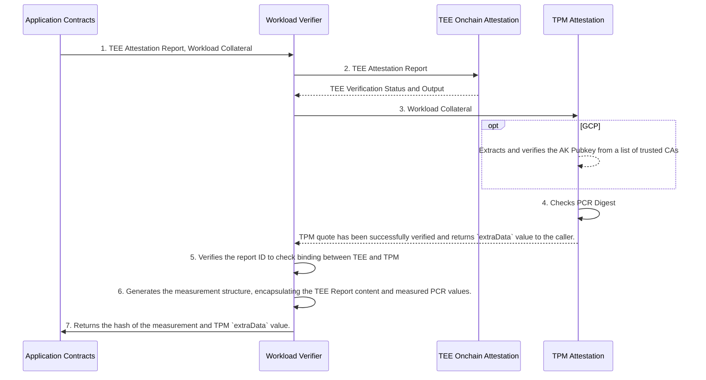
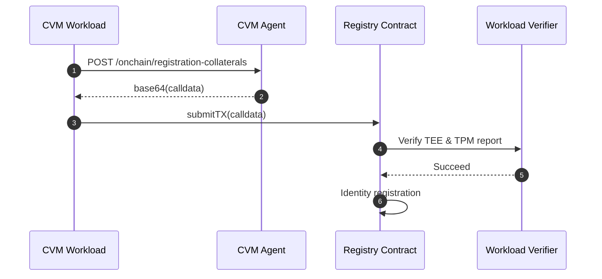

# Developer Guide

This guide provides detailed technical information for integrating and working with the TEE Workload Measurement and CVM Registry contracts.

## Table of Contents

- [Workload Measurement Contract](#workload-measurement-contract)
  - [Overview](#overview)
  - [Verification Flow](#verification-flow)
  - [Integration Guide](#integration-guide)
  - [API Reference](#api-reference)
  - [Data Structures](#data-structures)
  - [Gas Benchmarks](#gas-benchmarks)
- [CVM Registry Contract](#cvm-registry-contract)
  - [Overview](#overview-1)
  - [Core Concepts](#core-concepts)
  - [Lifecycle Operations](#lifecycle-operations)
  - [Integration Guide](#integration-guide-1)
  - [Security Considerations](#security-considerations)

---

## Workload Measurement Contract

### Overview

The Workload Verifier contract (`WorkloadVerifier.sol`) provides cryptographic verification of CVM workload integrity by combining TEE attestation with TPM-based boot measurements. It ensures that code running in a CVM has not been tampered with and is executing on genuine TEE hardware.

**Contract Location**: [`contracts/src/WorkloadVerifier.sol`](../src/WorkloadVerifier.sol)

**Dependencies**:
1. [Automata DCAP Attestation](https://github.com/automata-network/automata-dcap-attestation/tree/main/evm) - Verifies Intel TDX quotes
2. [Automata SEV-SNP Attestation](https://github.com/automata-network/amd-sev-snp-attestation-sdk/tree/main/zk/contracts) - Verifies AMD SEV-SNP attestation reports
3. [Automata TPM Attestation](https://github.com/automata-network/automata-tpm-attestation) - Verifies TPM quotes and PCR measurements

### Verification Flow



#### Step-by-Step Process

1. **Submit Attestation Data**: The application submits the TEE Attestation Report and workload collateral to the `WorkloadVerifier.sol` contract. Workload collateral is a collection of data, consisting the TPM quote, TPM Signature, TPM Attestation Key (or AK certificate chain) and an array of PCR measurement.

2. **TEE Attestation Report Verification**: Shows that the CVM is running in a TEE provided by genuine hardware.

    > **Azure-specific**: If the CVM were hosted on Azure, this step also ensures that the report data must contain the hash of the TPM Attestation Key.

3. **TPM Quote Verification**: The TPM quote and signature are verified against the provided TPM Attestation Key.

    > **GCP-specific**: If TPM Attestation Key were not checked in *step 2(a)*, the key is extracted from the leaf of the AK Certificate Chain, which must be checked for valid root of trust.

4. **PCR Measurement Verification**: The list of PCR indices provided in the collateral must match with the PCR selection bitmap in the TPM quote; the hash chain of PCR measurement values yields a value that must match the PCR digest value in the TPM quote.

5. **TEE-TPM Binding Verification**: The provided Report ID must be found in both TEE Attestation Report and PCR 16 of the TPM. This step indicates the binding between TEE and TPM.

    > **Exception**: The only exception to this rule applies to Azure TDX CVM. As stated in *2(a)*, the report data provides us with information about the AK that signs the TPM quote, which is already verified in *step 3*.

6. **Measurement Generation**: Generates the `Measurement` object. A data structure containing the content of the TEE Report and an array of measured PCRs. Each PCR may contain a deterministic PCR value and/or a list of event logs that the workload produces.

    > External contracts may retrieve the Golden Measurement instead of the hash, if developers intend to perform additional checks on the measurement values.

7. **Measurement Hash Computation**: Optionally, computes the measurement hash, which is a holistic representation of the state of the CVM. Application developers can provide a reference measurement as a policy that CVM workloads must comply, also known as the **Golden Measurement** value. Developers should also check for the correctness of TPM `extraData` value.


**Use Cases:**

1. **Integrity Verification**: Compare the returned hash against expected measurement values to ensure workload authenticity
2. **Trust Chains**: Store the hash onchain to build verifiable trust relationships between different workloads
3. **Compliance Tracking**: Use the hash as evidence for audit trails and regulatory compliance
4. **Access Control**: Gate access to sensitive operations based on verified workload measurements
5. **Reputation Systems**: Build reputation scores based on consistently verified workload behavior

### Gas Benchmarks

The table below shows gas costs to measure CVMs with various TEEs hosted on Azure and GCP.

|  | TEE Report Verification Gas Cost | AK Pubkey Verification Gas Cost | TPM Signature Verification Gas Cost | PCR Measurement Check Gas Cost | Report ID Binding Check Gas Cost | Measurement Computation Gas Cost |
| --- | --- | --- | --- | --- | --- | --- |
| Azure TDX | ~5M[^1] gas (Onchain DCAP) | 50k[^2] gas | 42k gas (RSA) | 14k gas | 3k gas | 23k gas |
| Azure AMD-SEV-SNP | 240k[^3] gas (RiscZero Groth16) | 50k[^2] gas | 42k gas (RSA) | 14k gas | 3k gas | 23k gas |
| GCP TDX | ~5M[^1] gas (Onchain DCAP) | 397k[^1][^4] gas | 339k[^1] gas (secp256r1) | 16k gas | 385k[^5] gas | 82k gas |
| GCP AMD-SEV-SNP | 240k[^3] gas (RiscZero Groth16) | 397k[^1][^4] gas | 339k[^1] gas (secp256r1) | 16k gas | 5k gas | 82k gas |


## CVM Registry Contract

### Overview

The CVM Workload Onchain Registry provides identity and lifecycle management for CVM workloads. It plays a critical role in:

1. **Maintaining CVM Credentials**: Registers and tracks user-provided CVM credentials to identify the VM.
    - Verifies TEE reports (Intel TDX Quotes or AMD SEV-SNP Reports) along with TPM quotes to confirm that the user credential is provisioned by a TPM with genuine TEE hardware.

2. **Onchain Identity Authentication**: Once registered, credentials serve as an identity to authenticate CVM onchain activities.
    - Consumer contracts can query the Registry to determine the validity of registered credentials.
    - Validity is determined by factors such as the age of TEE and TPM reports (time elapsed since recent submissions), and the contents of the TEE Report Body (such as Intel TDX TCB Status).

**Contract Location**: [`contracts/src/usecases/CVMRegistry.sol`](../contracts/src/usecases/CVMRegistry.sol)

**Key Dependencies**:
- `WorkloadVerifier` - Verifies TEE report, TPM quote, and PCR measurements
- `ITpmAttestation` - Extracts and validates TPM extra data

### Core Concepts

#### CVM Identity

A CVM's identity is represented by an asymmetric key generated using the [Owner hierarchy](https://github.com/nokia/TPMCourse/blob/master/docs/keys.md#creating-keys) by the TPM, which is enabled with persistence (re-usable even after CVM reboots). The identity contains:
- The public portion of the key
- Metadata describing the signature and hashing algorithms (using TPM constants as defined in the [TPM2 specification](https://trustedcomputinggroup.org/wp-content/uploads/TPM-Rev-2.0-Part-2-Structures-01.38.pdf))

**Identity Encoding Format**:
```
encoded_cvm_identity = bytes2 sig_scheme || bytes2 curve || bytes2 hash_algo || <pubkey_value>
```

**Currently Supported**: NIST P256 **uncompressed (omitting 0x04 prefix)** keys using SHA256 hash:

```
SIG_SCHEME  = 0x0018 (TPM_ALG_ECDSA)
CURVE       = 0x0003 (TPM_ECC_NIST_P256)
HASH_ALGO   = 0x000B (TPM_ALG_SHA256)
PUBKEY_VALUE = x || y (64 bytes)

encoded_cvm_identity = 0x0018 || 0x0003 || 0x000B || x || y
```

**Identity Hash**: The identity hash serves as the primary key for all registry operations:

```solidity
cvm_identity_hash = keccak256(encoded_cvm_identity)
```

The CVM Identity hash must be embedded in the TPM `extraData` field for validation. The full CVM Identity must be provided to the contract as part of the Workload Collateral for both key registration and key rotation steps.

#### Freshness Windows (TTL)

The registry enforces freshness requirements for both TEE and TPM attestations:

- **TEE TTL**: Time window for TEE attestation validity (default: 30 days)
- **TPM TTL**: Time window for TPM attestation validity (default: 60 days)

These TTLs can be customized per CVM identity through signed requests.

#### Domain Separation

All signed operations use domain-separated messages to prevent cross-contract and cross-chain replay attacks. The format is:

```solidity
abi.encodePacked(prefix, uint16(chainid), address(this), userData)
```

**Message Prefixes**:
- `"CVM_WORKLOAD_REATTEST_TPM"` - For TPM re-attestation
- `"CVM_WORKLOAD_TTL_CONFIG"` - For TTL configuration
- `"CVM_WORKLOAD_USER_MESSAGE"` - For general application-specific payloads


### General Workflowo

## CVM Registration

### Verification of TEE Collaterals
The registration process involves verifying all TEE collaterals on the CVM Registry Contract. The registry Contract uses `WorkloadVerifier.sol` to verify the TEE and TPM report, retrive CVM identity, and register it on-chain.



**Workflow Explanation**:

Both the **CVM Workload** and **CVM Agent** run inside the Confidential VM. The CVM Agent handles attestation, workload management, and runtime attestation. The workflow proceeds as follows:

1. **Request Registration Collaterals**: The CVM Workload sends a POST request to the CVM Agent's `/onchain/registration-collaterals` endpoint.

2. **Generate Attestation Collaterals**: The CVM Agent performs attestation and workload management tasks:
   - Generates TEE attestation report (Intel TDX Quote or AMD SEV-SNP Report)
   - Collects TPM quote with PCR measurements
   - Gathers TPM Attestation Key and certificate chain (if applicable)
   - Embeds CVM identity hash in TPM extraData
   - Encodes all collaterals as base64-encoded calldata and returns it to the workload

3. **Submit Registration Transaction**: The CVM Workload submits a blockchain transaction to the Registry Contract with the `attestCvm` function call containing the attestation collaterals.

4. **Verify TEE & TPM Reports**: The Registry Contract delegates verification to the Workload Verifier contract, which validates:
   - TEE report authenticity and integrity
   - TPM Attestation Key legitimacy
   - TPM quote signature
   - PCR measurements and binding between TEE and TPM

5. **Return Verification Result**: The Workload Verifier returns success with verified measurement data and TPM extraData.

6. **Register CVM Identity**: The Registry Contract stores the CVM configuration (identity, measurement hash, timestamps, TTLs) and completes registration. The registered identity is a public key that uniquely represents this CVM onchain. The corresponding private key is stored securely within the CVM and used by the CVM Agent to sign any message provided by the workload. Following successful registration, any message signed by this CVM Identity is considered trusted within the configured TTL window.

Once the TTL has expired, the CVM must reattest its TEE collaterals with the Registry contract again. To reattest, simply perform the registration steps again.


### Lifecycle Operations

#### 1. Registration (`attestCvm`)

Initial registration of a CVM identity using full attestation (TEE + TPM).

**Process**:
1. Derive `cvmIdentityHash` from the provided CVM identity public key
2. If first-time registration, initialize cloud/TEE types and default TTLs
3. Call `workloadVerifier.verifyAttestation(...)` to verify TEE report, TPM quote, and PCRs
4. Extract and validate identity hash from `tpmExtraData` (must match computed identity)
5. Compute canonical measurement via `workloadVerifier.getMeasurement(...)`
6. Store configuration (identity, timestamps, measurement hash, TPM AK)
7. Emit `CVMUpdated` event

**Important**: No signature from the CVM identity is required for initial registration—trust is bootstrapped entirely by attestation binding.

**Function Signature**:
```solidity
function attestCvm(
    TEEType teeType,
    TeeReportType teeReportType,
    CloudType cloudType,
    bytes calldata teeAttestationReport,
    WorkloadCollaterals calldata wc
) external payable;
```

#### 2. Re-attestation (`reattestCvmWithTpm`)

Refresh TPM collateral while reusing existing TEE attestation. Optionally supports identity key rotation.

**Use When**:
- TPM collateral has expired but TEE collateral is still within TTL
- Identity key rotation is desired

**Process**:
1. Validate CVM-signed request with message: `prefix + chainid + contract + (nonce, sha256(tpmQuote))`
2. Verify signature against stored `cvmIdentity`
3. Verify TPM quote using stored `tpmAk`
4. Check PCR measurements and extract new `extraData`
5. Reconstruct measurement (reusing TEE report from storage)
6. If `wc.cvmIdentity` hash differs (key rotation):
   - Ensure TPM extra data embeds the new identity hash
   - Create new config entry with new hash, copying prior attestation state
   - Copy `tpmAk` to new configuration
7. Else, update `measurementHash` and TPM freshness timestamp
8. Emit `CVMUpdated` event

**Important**: TEE freshness timestamp is NOT refreshed—design enforces periodic full re-attestation at TEE TTL boundary.

**Function Signature**:
```solidity
function reattestCvmWithTpm(
    bytes calldata signature,
    WorkloadCollaterals calldata wc
) external;
```

#### 3. TTL Management (`setCollateralTTL`)

Configure custom freshness windows for TEE and TPM attestations.

**Process**:
1. Validate both TEE and TPM collaterals are currently valid
2. Verify CVM-signed request with message: `prefix + chainid + contract + (nonce, newTEEttl, newTPMttl)`
3. Update `teeTTL` and/or `tpmTTL`
4. Increment nonce
5. Emit `CVMTTLUpdated` event

**Function Signature**:
```solidity
function setCollateralTTL(
    bytes32 cvmIdentityHash,
    bytes calldata signature,
    uint64 teeTTL,
    uint64 tpmTTL
) external;
```

